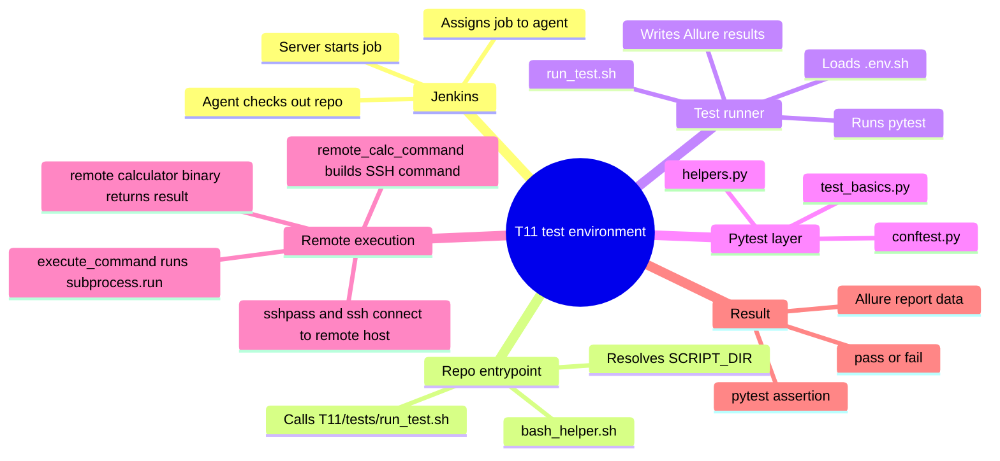

# Jenkins Test Flow For T11

This diagram reflects the current execution path in this repository.

Important correction:
- The fixture does not open the SSH connection by itself.
- `remote_calc_command` in `tests/conftest.py` builds the SSH command.
- `execute_command()` in `tests/helpers.py` actually runs that command.

## Main Flow

```mermaid
flowchart TD
    A[Jenkins server starts job] --> B[Jenkins assigns build to agent / executor machine]
    B --> C[Agent checks out repo into workspace<br/>example: /home/mniedziolka/jenkins-agent/workspace/at_1]
    C --> D[Jenkins runs bash_helper.sh from the checked out repo]
    D --> E[bash_helper.sh resolves its own directory<br/>SCRIPT_DIR from BASH_SOURCE[0]]
    E --> F[bash_helper.sh runs T11/tests/run_test.sh]
    F --> G[run_test.sh prepares environment<br/>WORKSPACE_DIR ALLURE_RESULTS_DIR PYTHON_BIN]
    G --> H[run_test.sh sources T11/tests/.env.sh]
    H --> I[run_test.sh runs pytest with -k "div or mul"]
    I --> J[pytest discovers tests and loads tests/conftest.py]
    J --> K[fixture remote_calc_command reads env vars<br/>CALC_SSH_PASSWORD CALC_SSH_USER CALC_SSH_HOST CALC_REMOTE_PATH]
    K --> L[test file calls execute_command with remote_calc_command and operator args]
    L --> M[tests/helpers.py runs subprocess.run(...) ]
    M --> N[sshpass + ssh connects to remote machine]
    N --> O[remote machine runs calculator binary<br/>example: /home/vboxuser1/calc2/b_calc]
    O --> P[stdout result returns to pytest]
    P --> Q[test asserts expected result and Allure stores report data]
```

## Short Mind Map



## File Mapping

- Entry wrapper: `bash_helper.sh`
- Test runner: `T11/tests/run_test.sh`
- Shared fixtures: `T11/tests/conftest.py`
- Command execution helper: `T11/tests/helpers.py`
- Example test: `T11/tests/test_basics.py`

## One Useful Clarification

Your step 7 is almost correct, but the responsibility is split:

- `remote_calc_command` fixture builds the SSH command list.
- `test_basics.py` passes that command into `execute_command(...)`.
- `execute_command(...)` uses `subprocess.run(...)` to actually execute the remote command.
